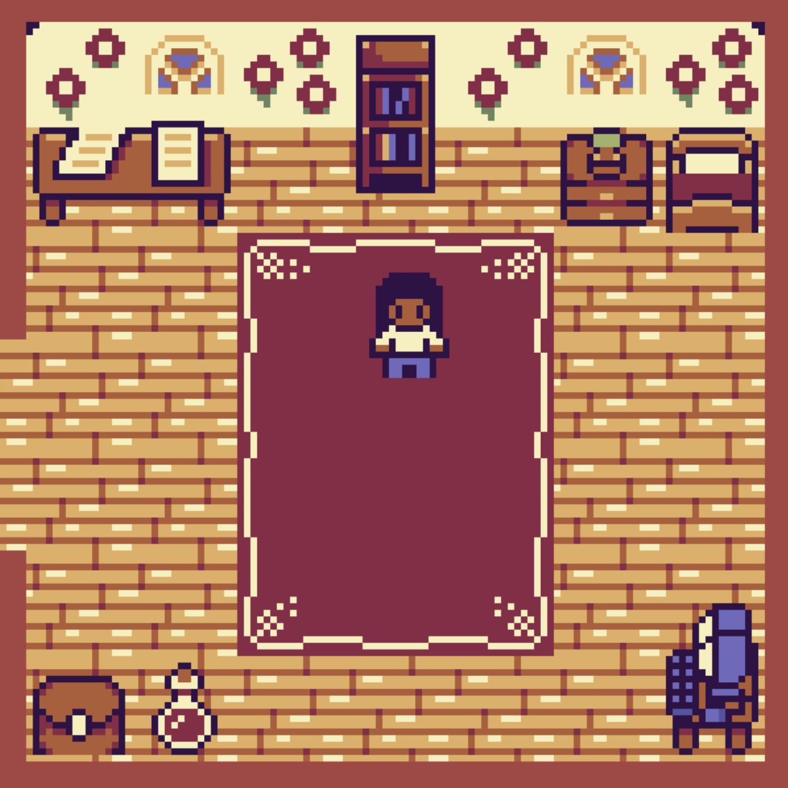

# andria's cottage - 2D game portfolio

I wanted to try building something different and thought I could make a little 2D game to showcase who I am.

This works on both desktop and mobile.

Live Demo : https://andria-hibe.github.io/2d-portfolio/

Inspired by JSLegendDev : https://jslegenddev.substack.com/p/how-to-implement-player-controls

The tileset is from: https://momen-games.itch.io/happy-la-v2-ts
